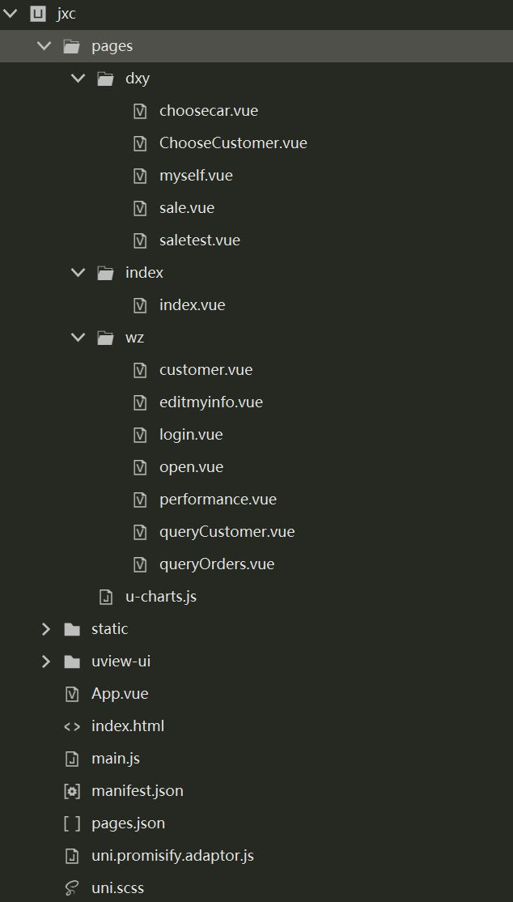

# 项目结构文档

# PC端

## 一、总体结构

- ## java

  存放Java源代码

- ## resources

  存放项目资源文件如配置文件

- ## webapp

  存放网页端web应用相关文件

  

  

  ------

  

## 二、java 文件夹结构

java文件夹下存放着**config**、**controller**、**dao**、**domain**、**entity**、**service**、**util** 等软件包。

------

## 2.1 config

config包中存放着应用程序的配置文件和配置类。

- **MyRealm**  

  MyRealm 类用于进行身份验证和授权，例如查询数据库、验证密码、获取用户角色和权限等。

- **ShiroConfig**

  ShiroConfig类用于配置和管理Shiro安全框架，实现权限管理、身份验证、拦截等等。

------

## 2.2 controller

controller包下包含许多controller类，用于处理应用程序的各种请求，并返回相应的响应。

- **CustomerController**

  CustomerController类为客户控制器，可实现查询下拉框客户信息、在tablegrid中显示客户信息、添加或修改客户、删除客户。

- **DrawImageController**

  DrawImageController类用来生成图片验证码。

- **GoodsController**

  GoodsController类为商品控制器，用来实现查询、修改、增加、删除商品、生成商品类别等等。

- **GoodsTypeController**

  GoodsTypeController类为商品类别控制器，用来实现查询、增加、删除商品类别。

- **IndexController**

  IndexController类为系统首页请求控制器，实现进入登录界面。

- **LogController**

  LogController类为系统日志控制器，实现分页查询系统日志。

- **MenuController**

  MenuController类为导航菜单控制器，用于查询当前角色的权限所能查看的菜单，并在导航菜单中只显示这些菜单。

- **PurchaseListGoodsController**

  PurchaseListGoodsController类为进货商品控制器，用于实现查询、保存、删除进货单信息及对应商品信息、修改付款状态以及进货商品统计。

- **RolesController**

  RolesController类为角色控制器，用于实现保存用户登录的角色、查询、添加、修改、删除角色信息以及设置菜单权限。

- **SaleListGoodsController**

  SaleListGoodsController类为销售商品控制器，用于实现查询、保存、删除销售单信息及商品信息、修改付款状态以及销售商品按日按月按年做统计表。

- **SupplierController**

  SupplierController类为供应商控制器，可实现查询下拉框、在tablegrid中显示、添加或修改、删除供应商信息。

- **UnitController**

  UnitController类为商品单位控制器，可实现增加、修改、删除商品单位。

- **UserController**

  UserController类为用户信息控制器，用于实现系统登录、获得当前登录的用户信息、查询、添加、修改、删除用户信息、设置用户角色、修改密码以及安全退出。

  ------

  ## 2.3 dao

  

  - dao包存放这用于封装数据访问和操作逻辑的众多接口。

  - 每个接口都提供了一系列方法，用于对相应的数据进行增删改查等操作。这些接口通过定义规范化的方法，可以在具体的数据访问实现类中进行实现，并在业务逻辑层中调用这些方法来进行数据操作。通过这种方式，实现了数据访问逻辑的统一管理和解耦，提高了代码的可维护性和扩展性。

  ------

  ## 2.4 domain

  

  domain包下含有错误码接口、值对象类以及成功码接口。serviceVO可以帮助封装和传递业务数据，通过定义规范化的错误代码和成功代码，可以在业务逻辑中统一处理错误和成功情况，提供清晰的反馈信息给调用方。

  ------

  ## 2.5 entity

  

  - entity下的各种实体类与数据库中对应的表相映射，作为数据容器用来持久化存储数据，在应用程序中对实体对象的操作可以直接映射到数据库操作。

  - 通过实体类，数据访问层可以将业务对象转换为数据库操作，并将数据库的结果转换为实体对象。

  ------

  ## 2.6 service
  
  
  
  - Service层下的各个接口是提供给controller层的调用，是业务逻辑的核心实现层级。
  
  - impl层则是对各个接口函数的实现。
  
  ------
  
  ## 2.7 util
  
  

- util为实用工具层，提供通用的功能方法，方便调用。
- BigDecimalUtil为数字工具类，保留两位浮点小数；
- DateUtil为时间日期工具类；
- StringUtil为字符串工具类。

------

### 三、resource

"resource"层是软件开发中常见的一个层级，用于存放应用程序所需的各种资源文件。在这个层级中，通常包括了"mapper"和"application.properties"两个重要的部分。

- mapper层为映射器层，将数据库表与java类相映射。使得开发者能够通过简洁的代码来执行数据库操作，提高了开发效率和维护性。
- application.properties为配置文件，用于存放应用程序的配置信息。

### 四、webapp

webapp文件夹是用来存放网页端的相关文件和资源的目录。

- basicData存放基础信息的html文件，包括顾客信息、供货商信息、商品信息。
- common为当前库存查询页面，为许多菜单所调用。
- count为统计报表的页面，包括供应商统计、客户统计、商品采购统计、商品销售统计、按日统计分析、按月统计分析、按年统计分析、历年统计、按销售人员统计分析。
- power为系统管理页面，包括角色管理、用户管理、系统日志。
- sale为销售管理页面，包括销售出库、销售单据查询。
- static存放着许多静态资源，如图片、css文件、js文件、easyui文件。js文件用于实现网页的各种交互行为和动态效果，CSS文件用于定义网页的样式和布局，easyui文件提供现成的UI外观。
- stock为库存报警页面。
- login.html为登录页面。
- main.html为首页页面。

------

### 五、不同部分的联系

- 前端页面需要Controller的url实现各种功能；
- Controller负责接收和响应用户请求，调用Service层；
- Service处理业务逻辑，通过ServiceImply并调用Dao层的方法访问数据；
- Dao层与数据库进行交互，提供数据持久化的功能；
- Entity实体类与数据库中对应的表相对应；
- Mapper定义了Dao层方法与Entity层的映射关系，进而完成对数据库的操作。
- 这些组件共同协作，构成了一个完整的应用程序。

# 移动端

## 一、总体结构

## 二、页面结构

### 2.1 一级结构

* index页面：库存信息查询页面。该界面只有在用户成功登录后才会显示正确内容，否则将显示提示登录信息。用户登录后可以通过选择品牌、车型以及手动输入车名（支持模糊搜索）查询相关汽车的库存信息，在缺省情况下，将查询显示所有汽车的库存信息。该页面还支持了分页查询，既每次只从后端数据库中获取20条信息，用户滑倒底部后自动刷新获取更多的信息，以提高访问速度。
* sale页面：销售单据出具页面。该界面的内容与PC端保持一致，用户选择待出库商品、选择出具日期等信息后，点击提交即可出具销售单实现在移动端的车辆出库以及销售单据出具。
* myself页面：个人信息页面。该界面主要展示销售人员的个人信息，以及提供关联客户查询、已出具销售单查询、业绩统计、修改个人信息的按钮。
* open页面：开屏展示页面。该界面主要在开启程序时展示一个宣传或者广告页面，用户可以手动跳过。

### 2.2 二级结构

#### sale页面

* choosecar页面：选择待出库汽车界面。销售人员在出具销售单时需要选择待出库的汽车即来到此界面，在该界面同样可以通过品牌、车型以及车名搜索相关汽车的库存信息，检索到目标车辆后点击即可填写出库价格、出库数量。选择成功返回销售单据出具页面
* chooseCustomer页面：选择客户页面。销售人员在出具销售单时需要选择当前销售单的目标客户即来到此界面，在该界面可以通过搜索检索到目标客户，选择成功返回销售单据出具页面

#### myself页面

* quryOrders页面：查询当前登录的销售人员已开具的销售单信息，由于移动端信息显示的限制，销售人员可以通过下拉菜单选择优先显示订单ID或者优先显示订单客户名称，详细信息需要点击展开按钮。
* queryCustomer页面：查询当前登陆的销售人员开具过销售单的客户信息。页面主要显示客户名称以及成交金额，具体信息需要点击展开按钮。
* performance页面：查询当前登录的销售人员在某事件段内的销售业绩（以销售金额的形式从底部弹出显示），如果需要了解在最近一段时间（一年）内的业绩变化图，也可以点击按钮生成业绩变化折现图标，这个图标可以动态地直观地展示该销售人员的业绩变化。
* editMyInfo页面：修改个人信息页面。在该页面销售人员可以修改自己的真实姓名、账号、密码，并且修改完成后返回个人信息页面下拉刷新即可更新展示个人信息
* login页面：登录界面。若用户未登录，需要在该界面进行登录。

## 三、页面间的联系

* 若未登录，则库存信息查询、销售单据开具页面将无法正常显示而是提示用户先登录。
* 在销售单据开具页面需要向后端提供销售人员的userId，同样来自于用户登录时在浏览器的缓存，而不需要再次向后端发送请求。